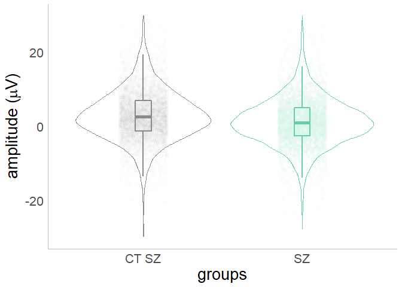

Mixed Models
================
Douwe John Horsthuis
2022-06-19


# Mixed Models in R

*As coded and explained and created by [Ana
Francisco](https://www.cognitiveneurolab.com/dr-ana-a-francisco) and
written down and edited by [Douwe
Horsthuis](https://github.com/DouweHorsthuis)*

## What are mixed models and why use them

## How to use this R code to create your own mixed models

## The actual code explained

Here we are using a generalized version of the code that you can addapt
to use for your own project.

### Loading libraries

You’ll need at least these libraries to do the basics, we are also
cleaning the enviroment (in case you want to re-run it from the start)
and prefenting R from using scientific notations.

``` r
library(lme4)#library for mixed models 
library(lmerTest)#library for P values
library(ggplot2)#library for plotting
library(doBy)#for summaries
library(dplyr)#for many basics 
rm(list=ls())#cleans environment
options(scipen=999)#no scientific notations
```

### Loading data and seeing if it makes sense

We need to load data from a .csv file, or a .text file. We haven’t
tested, but `library(R.matlab)` and `readMat("filename")` to do the same
with a MATLAB file. This file should have a couple of things:

1.  Dependent variable; such as amplitude from trial by trial data from
    individual subjects

    -   This should be a single value per trial

    -   The more factors you want to include in your model, the more
        trials you need per participant. If you have too few the model
        won’t complete.

2.  Fixed factor; such as

    -   group, this is different between some people but not all

    -   conditions

3.  Random factor; such as

    -   ID or something that identifies the individual who’s data is
        used, since we know that the data of each individual is always
        going to be different from the next.

    -   Trial number

## Loading and cleaning the data

``` r
#fill out these 3 variables that will be different depending on your data
load_path="C:/Users/douwe/OneDrive/Documents/Github/Mixed-effect-models/data/"
data_name="p2.txt"
amount_trial= 200 #how many trials do you want to use

dataset_full=read.table(paste(load_path,data_name,sep=""), header=TRUE)#imports data, header=TRUE so we keep names of columns
```

``` r
#re-defines column names
colnames(dataset_full)=c("subjects","group", "group2","condition", "trial","o1","oz","o2","avg")  #give the correct name to each of your columns

#creates factors
dataset_full$subjects=as.factor(dataset_full$subjects)
dataset_full$trial=as.factor(dataset_full$trial)

dataset_full$group2 <- factor (dataset_full$group2, levels = c(1:5), labels = c("CT 22q", "22q-", "22q+", "CT SZ", "SZ"))
dataset_full$condition <- factor (dataset_full$condition, levels = c(1:5), labels = c("145", "245", "495", "995", "2495"))

#checks
#checks
length(unique(dataset_full$subjects))
```

    ## [1] 127

``` r
sort(unique(dataset_full$group2))
```

    ## [1] CT 22q 22q-   22q+   CT SZ  SZ    
    ## Levels: CT 22q 22q- 22q+ CT SZ SZ

``` r
sort(unique(dataset_full$condition))
```

    ## [1] 145  245  495  995  2495
    ## Levels: 145 245 495 995 2495

``` r
str(dataset_full)
```

    ## 'data.frame':    119693 obs. of  9 variables:
    ##  $ subjects : Factor w/ 127 levels "1","2","3","4",..: 1 1 1 1 1 1 1 1 1 1 ...
    ##  $ group    : int  1 1 1 1 1 1 1 1 1 1 ...
    ##  $ group2   : Factor w/ 5 levels "CT 22q","22q-",..: 1 1 1 1 1 1 1 1 1 1 ...
    ##  $ condition: Factor w/ 5 levels "145","245","495",..: 1 1 1 1 1 1 1 1 1 1 ...
    ##  $ trial    : Factor w/ 296 levels "1","2","3","4",..: 1 2 3 4 5 6 7 8 9 10 ...
    ##  $ o1       : num  15.5 -13.9 14.1 22.2 26.6 ...
    ##  $ oz       : num  17.1 -21 18.3 17.7 30.6 ...
    ##  $ o2       : num  13.34 -20.3 7.93 1.41 23.27 ...
    ##  $ avg      : num  15.3 -18.4 13.5 13.8 26.8 ...

``` r
# getting rid of data that is not needed for example
dataset<- subset(dataset_full, select = -c(group, o1, oz, o2))
dataset<- subset(dataset, group2 != "CT 22q" &  group2 != "22q-" &  group2 != "22q+" )

#creates summary-mean and standard deviation
summaryBy(avg ~ subj, data=dataset, FUN=c(length,mean,sd))
```

    ##   avg.length avg.mean   avg.sd
    ## 1      53137  2.34156 6.985797

``` r
#randomly selects x amount trials per subject 
reduceddataset <- dataset %>% group_by(subjects) %>% sample_n(size = amount_trial)
```

## Plotting data

Here we are using ggplot to plot the data. This is an example dataset.
This is Go-No-Go data from the IAPS paradigm, where we compare controls
and people with schizophrenia. We have different conditions (isi between
stimulation).

``` r
vgp2Plot <- ggplot(reduceddataset, aes(x = group2, y = avg, color=group2)) 
vgp2Plot <- vgp2Plot + theme(legend.key.size = unit(1, "cm"))
vgp2Plot <- vgp2Plot + theme(legend.key.size = unit(1, "cm"))
vgp2Plot <- vgp2Plot + geom_violin() #position = position_nudge(x = .2, y = 0), adjust=1, lwd=1.2, lty=3
vgp2Plot <- vgp2Plot + geom_boxplot(width=0.1, alpha=1, outlier.shape = NA, lwd=1, position=position_dodge(0.5))
vgp2Plot <- vgp2Plot + geom_jitter(width=0.15, alpha = 0.01)
vgp2Plot <- vgp2Plot + scale_color_manual(values=c("snow4", "aquamarine3", "pink", "orange", "purple"))  
vgp2Plot <- vgp2Plot + labs(y = expression(paste("amplitude (",mu,"V)")), x="groups")
vgp2Plot <- vgp2Plot + theme_minimal()
vgp2Plot <- vgp2Plot + theme(axis.line = element_line(colour = "grey"),
                             panel.grid.major = element_blank(),
                             panel.grid.minor = element_blank(),
                             panel.border = element_blank(),
                             panel.background = element_blank())
vgp2Plot <- vgp2Plot + theme(legend.position = "none")
vgp2Plot <- vgp2Plot + theme(text = element_text(family="sans", size=20))
vgp2Plot <- vgp2Plot + scale_y_continuous(limits = c(-30,30))
vgp2Plot
```

<!-- -->

## Creating subsets for the model

A mixed effects model should be ran on factors we want to compare with
each other, in this case the amplitude for the p2 between the 4 groups.
In the case of this example, the 22q group is age matched to their
controls, and the sz group has their own. Due to the age difference we
should not compare between these groups. So we also need to create
subgroups. We also want to be able to look only at a specific condition,
so we also separate per conditions

``` r
vg145_sz <- subset(reduceddataset, condition=="145")
vg245_sz <- subset(reduceddataset, condition=="245")
vg495_sz <- subset(reduceddataset, condition=="495")
vg995_sz <- subset(reduceddataset, condition=="995")
vg2495_sz <- subset(reduceddataset, condition=="2495")
```

## Mixed model

In this example, the depended variable is amplitude, group is a fixed
factor, subjects and trial are random factors. We run 6 models, the
first 5 look at amplitude by group, the last one also looks at group and
condition, because of the \* between group and condition, it will also
look for interactions between the two.

``` r
model1.01 = lmer(avg~group2+(1|subjects)+(1|trial), data = vg145_sz, REML=FALSE)
summary(model1.01)
```

    ## Linear mixed model fit by maximum likelihood . t-tests use Satterthwaite's
    ##   method [lmerModLmerTest]
    ## Formula: avg ~ group2 + (1 | subjects) + (1 | trial)
    ##    Data: vg145_sz
    ## 
    ##      AIC      BIC   logLik deviance df.resid 
    ##  14616.7  14645.3  -7303.4  14606.7     2243 
    ## 
    ## Scaled residuals: 
    ##     Min      1Q  Median      3Q     Max 
    ## -5.6356 -0.5576 -0.0074  0.5635  4.8368 
    ## 
    ## Random effects:
    ##  Groups   Name        Variance Std.Dev.
    ##  trial    (Intercept)  0.07418 0.2724  
    ##  subjects (Intercept)  7.66731 2.7690  
    ##  Residual             36.70090 6.0581  
    ## Number of obs: 2248, groups:  trial, 211; subjects, 55
    ## 
    ## Fixed effects:
    ##             Estimate Std. Error      df t value Pr(>|t|)    
    ## (Intercept)   2.1299     0.5178 55.4243   4.113  0.00013 ***
    ## group2SZ     -1.3448     0.8009 55.5300  -1.679  0.09875 .  
    ## ---
    ## Signif. codes:  0 '***' 0.001 '**' 0.01 '*' 0.05 '.' 0.1 ' ' 1
    ## 
    ## Correlation of Fixed Effects:
    ##          (Intr)
    ## group2SZ -0.646

We see that the difference **is not significant** for this condition
between the groups, we also see that the random effects are not
significant

``` r
model1.02 = lmer(avg~group2+(1|subjects)+(1|trial), data = vg245_sz, REML=FALSE)
summary(model1.02)
```

    ## Linear mixed model fit by maximum likelihood . t-tests use Satterthwaite's
    ##   method [lmerModLmerTest]
    ## Formula: avg ~ group2 + (1 | subjects) + (1 | trial)
    ##    Data: vg245_sz
    ## 
    ##      AIC      BIC   logLik deviance df.resid 
    ##  14549.9  14578.4  -7270.0  14539.9     2194 
    ## 
    ## Scaled residuals: 
    ##     Min      1Q  Median      3Q     Max 
    ## -8.2015 -0.5380 -0.0159  0.5167  6.5630 
    ## 
    ## Random effects:
    ##  Groups   Name        Variance Std.Dev.
    ##  trial    (Intercept)  0.3781  0.6149  
    ##  subjects (Intercept)  6.7794  2.6037  
    ##  Residual             41.0593  6.4078  
    ## Number of obs: 2199, groups:  trial, 217; subjects, 55
    ## 
    ## Fixed effects:
    ##             Estimate Std. Error      df t value      Pr(>|t|)    
    ## (Intercept)   3.3867     0.4958 55.3544   6.830 0.00000000696 ***
    ## group2SZ     -1.6598     0.7651 54.9108  -2.169        0.0344 *  
    ## ---
    ## Signif. codes:  0 '***' 0.001 '**' 0.01 '*' 0.05 '.' 0.1 ' ' 1
    ## 
    ## Correlation of Fixed Effects:
    ##          (Intr)
    ## group2SZ -0.643

We see that the difference **is significant** for this condition between
the groups, we also see that the random effects are not significant

``` r
model1.03 = lmer(avg~group2+(1|subjects)+(1|trial), data = vg495_sz, REML=FALSE)
summary(model1.03)
```

    ## Linear mixed model fit by maximum likelihood . t-tests use Satterthwaite's
    ##   method [lmerModLmerTest]
    ## Formula: avg ~ group2 + (1 | subjects) + (1 | trial)
    ##    Data: vg495_sz
    ## 
    ##      AIC      BIC   logLik deviance df.resid 
    ##  14449.3  14477.8  -7219.7  14439.3     2177 
    ## 
    ## Scaled residuals: 
    ##     Min      1Q  Median      3Q     Max 
    ## -4.6707 -0.5665 -0.0238  0.5493  5.0120 
    ## 
    ## Random effects:
    ##  Groups   Name        Variance Std.Dev.
    ##  trial    (Intercept)  0.000   0.000   
    ##  subjects (Intercept)  5.753   2.398   
    ##  Residual             41.795   6.465   
    ## Number of obs: 2182, groups:  trial, 212; subjects, 55
    ## 
    ## Fixed effects:
    ##             Estimate Std. Error      df t value        Pr(>|t|)    
    ## (Intercept)   3.8412     0.4624 54.2398   8.307 0.0000000000306 ***
    ## group2SZ     -1.5891     0.7138 53.8589  -2.226          0.0302 *  
    ## ---
    ## Signif. codes:  0 '***' 0.001 '**' 0.01 '*' 0.05 '.' 0.1 ' ' 1
    ## 
    ## Correlation of Fixed Effects:
    ##          (Intr)
    ## group2SZ -0.648
    ## optimizer (nloptwrap) convergence code: 0 (OK)
    ## boundary (singular) fit: see help('isSingular')

We see that the difference **is significant** for this condition between
the groups, we also see that the random effects are not significant

``` r
model1.04 = lmer(avg~group2+(1|subjects)+(1|trial), data = vg995_sz, REML=FALSE)
summary(model1.04)
```

    ## Linear mixed model fit by maximum likelihood . t-tests use Satterthwaite's
    ##   method [lmerModLmerTest]
    ## Formula: avg ~ group2 + (1 | subjects) + (1 | trial)
    ##    Data: vg995_sz
    ## 
    ##      AIC      BIC   logLik deviance df.resid 
    ##  14201.3  14229.7  -7095.7  14191.3     2147 
    ## 
    ## Scaled residuals: 
    ##     Min      1Q  Median      3Q     Max 
    ## -5.9409 -0.5236 -0.0164  0.5197  8.1913 
    ## 
    ## Random effects:
    ##  Groups   Name        Variance Std.Dev.
    ##  trial    (Intercept)  0.000   0.000   
    ##  subjects (Intercept)  7.032   2.652   
    ##  Residual             40.624   6.374   
    ## Number of obs: 2152, groups:  trial, 197; subjects, 55
    ## 
    ## Fixed effects:
    ##             Estimate Std. Error      df t value       Pr(>|t|)    
    ## (Intercept)   3.9819     0.5030 55.2337   7.916 0.000000000116 ***
    ## group2SZ     -2.4543     0.7772 55.0540  -3.158        0.00258 ** 
    ## ---
    ## Signif. codes:  0 '***' 0.001 '**' 0.01 '*' 0.05 '.' 0.1 ' ' 1
    ## 
    ## Correlation of Fixed Effects:
    ##          (Intr)
    ## group2SZ -0.647
    ## optimizer (nloptwrap) convergence code: 0 (OK)
    ## boundary (singular) fit: see help('isSingular')

We see that the difference **is significant** for this condition between
the groups, we also see that the random effects are not significant

``` r
model1.05 = lmer(avg~group2+(1|subjects)+(1|trial), data = vg2495_sz, REML=FALSE)
summary(model1.05)
```

    ## Linear mixed model fit by maximum likelihood . t-tests use Satterthwaite's
    ##   method [lmerModLmerTest]
    ## Formula: avg ~ group2 + (1 | subjects) + (1 | trial)
    ##    Data: vg2495_sz
    ## 
    ##      AIC      BIC   logLik deviance df.resid 
    ##  14696.6  14725.1  -7343.3  14686.6     2214 
    ## 
    ## Scaled residuals: 
    ##     Min      1Q  Median      3Q     Max 
    ## -6.6642 -0.5704 -0.0128  0.5464  4.4358 
    ## 
    ## Random effects:
    ##  Groups   Name        Variance Std.Dev.
    ##  trial    (Intercept)  0.000   0.000   
    ##  subjects (Intercept)  7.297   2.701   
    ##  Residual             41.641   6.453   
    ## Number of obs: 2219, groups:  trial, 229; subjects, 55
    ## 
    ## Fixed effects:
    ##             Estimate Std. Error      df t value Pr(>|t|)    
    ## (Intercept)   2.1196     0.5107 55.3016   4.151 0.000115 ***
    ## group2SZ     -1.7644     0.7895 55.2339  -2.235 0.029484 *  
    ## ---
    ## Signif. codes:  0 '***' 0.001 '**' 0.01 '*' 0.05 '.' 0.1 ' ' 1
    ## 
    ## Correlation of Fixed Effects:
    ##          (Intr)
    ## group2SZ -0.647
    ## optimizer (nloptwrap) convergence code: 0 (OK)
    ## boundary (singular) fit: see help('isSingular')

We see that the difference **is significant** for this condition between
the groups, we also see that the random effects are not significant

``` r
model1.06 = lmer(avg~group2*condition+(1|subjects)+(1|trial), data = reduceddataset, REML=FALSE)
summary(model1.06)
```

    ## Linear mixed model fit by maximum likelihood . t-tests use Satterthwaite's
    ##   method [lmerModLmerTest]
    ## Formula: avg ~ group2 * condition + (1 | subjects) + (1 | trial)
    ##    Data: reduceddataset
    ## 
    ##      AIC      BIC   logLik deviance df.resid 
    ##  72260.5  72355.5 -36117.2  72234.5    10987 
    ## 
    ## Scaled residuals: 
    ##     Min      1Q  Median      3Q     Max 
    ## -8.4506 -0.5590 -0.0127  0.5468  8.1658 
    ## 
    ## Random effects:
    ##  Groups   Name        Variance Std.Dev.
    ##  trial    (Intercept)  0.1189  0.3448  
    ##  subjects (Intercept)  6.4501  2.5397  
    ##  Residual             40.8046  6.3879  
    ## Number of obs: 11000, groups:  trial, 257; subjects, 55
    ## 
    ## Fixed effects:
    ##                           Estimate  Std. Error          df t value
    ## (Intercept)                2.15340     0.48287    69.12631   4.460
    ## group2SZ                  -1.36797     0.74655    69.07286  -1.832
    ## condition245               1.21839     0.25006 10916.63795   4.873
    ## condition495               1.66715     0.25288 10927.40976   6.593
    ## condition995               1.79299     0.25317 10921.18433   7.082
    ## condition2495             -0.06514     0.25068 10927.03913  -0.260
    ## group2SZ:condition245     -0.28348     0.39079 10930.13509  -0.725
    ## group2SZ:condition495     -0.21347     0.39019 10922.83647  -0.547
    ## group2SZ:condition995     -1.07181     0.39185 10918.16726  -2.735
    ## group2SZ:condition2495    -0.32087     0.38877 10925.21238  -0.825
    ##                                Pr(>|t|)    
    ## (Intercept)            0.00003098650128 ***
    ## group2SZ                        0.07121 .  
    ## condition245           0.00000111741936 ***
    ## condition495           0.00000000004520 ***
    ## condition995           0.00000000000151 ***
    ## condition2495                   0.79500    
    ## group2SZ:condition245           0.46823    
    ## group2SZ:condition495           0.58433    
    ## group2SZ:condition995           0.00624 ** 
    ## group2SZ:condition2495          0.40919    
    ## ---
    ## Signif. codes:  0 '***' 0.001 '**' 0.01 '*' 0.05 '.' 0.1 ' ' 1
    ## 
    ## Correlation of Fixed Effects:
    ##             (Intr) grp2SZ cnd245 cnd495 cnd995 cn2495 g2SZ:245 g2SZ:4 g2SZ:9
    ## group2SZ    -0.645                                                          
    ## conditin245 -0.257  0.166                                                   
    ## conditin495 -0.254  0.164  0.491                                            
    ## conditin995 -0.254  0.164  0.490  0.485                                     
    ## conditn2495 -0.256  0.166  0.494  0.488  0.488                              
    ## grp2SZ:c245  0.164 -0.259 -0.640 -0.314 -0.314 -0.316                       
    ## grp2SZ:c495  0.165 -0.259 -0.318 -0.648 -0.314 -0.316  0.495                
    ## grp2SZ:c995  0.164 -0.258 -0.317 -0.313 -0.646 -0.315  0.493    0.493       
    ## grp2SZ:2495  0.165 -0.259 -0.319 -0.315 -0.315 -0.645  0.496    0.496  0.494

We see several things here

1.  Overall group is not significant

2.  condition 245 495 995 and 2495 are significant compared to condition
    145.

3.  The interactions:

    1.  sz&condition 245 with controls & 145 is not significant

    2.  sz&condition 495 with controls & 145 is not significant

    3.  sz&condition 995 with controls & 145 is significant

    4.  sz&condition 2495 with controls & 145 is significant
