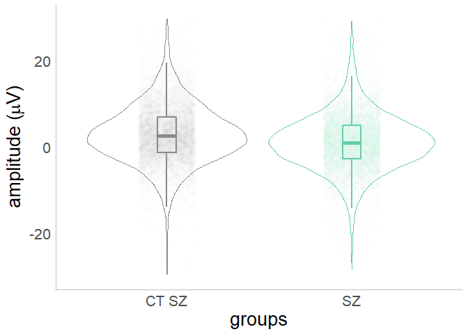

# Mixed Models

Douwe John Horsthuis 2022-06-26


# Mixed Models in R

*As coded and explained and created by [Ana Francisco](https://www.cognitiveneurolab.com/dr-ana-a-francisco) and written down and edited by [Douwe Horsthuis](https://github.com/DouweHorsthuis)*

What will you find in this repo:

1.  [What are mixed models and why use them](#what-are-mixed-models-and-why-use-them)

2.  [How to use this R code to create your own mixed models](#how-to-use-this-r-code-to-create-your-own-mixed-models)

    1.  [R libraries](#loading-r-libraries)

    2.  [What do you need to define](#what-do-you-need-to-define)

    3.  [Loading and cleaning the data](#loading-and-cleaning-the-data)

    4.  [Plotting data](#plotting-data)

    5.  [Creating subsets for the model](#creating-subsets-for-the-model)

    6.  [Mixed model](mixed-model)

## What are mixed models and why use them {#what-are-mixed-models-and-why-use-them}

## How to use this R code to create your own mixed models {#how-to-use-this-r-code-to-create-your-own-mixed-models}

## The actual code explained

Here we are using a adaptable version of the code that you need adapt to use for your own project.

### Loading R libraries {#loading-r-libraries}

For R code to work, you need to re-load libraries every time you open an R project. If it's the first time you load them, you'll need to install them. You can do this by running the line `install.package("thenameofthelibrary")`.

To use the following script, you'll need at least these libraries to do the basics, we are also cleaning the environment (in case you want to re-run it from the start) and preventing R from using scientific notations.

``` r
library(lme4)#library for mixed models 
library(lmerTest)#library for P values
library(ggplot2)#library for plotting
library(doBy)#for summaries
library(dplyr)#for many basics 
rm(list=ls())#cleans environment
options(scipen=999)#no scientific notations
```

### What do you need to define {#what-do-you-need-to-define}

We need to load data from a .csv file, or a .text file. We haven't tested, but `library(R.matlab)` and `readMat("filename")` to do the same with a MATLAB file. This file should have a couple of things:

1.  Dependent variable; such as amplitude from trial by trial data from individual subjects

    -   This should be a single value per trial

    -   The more factors you want to include in your model, the more trials you need per participant. If you have too few the model won't complete.

2.  Fixed factor; such as

    -   group, this is different between some people but not all

    -   conditions

3.  Random factor; such as

    -   ID or something that identifies the individual who's data is used, since we know that the data of each individual is always going to be different from the next.

    -   Trial number

## Loading and cleaning the data {#loading-and-cleaning-the-data}

``` r
#fill out these 3 variables that will be different depending on your data
load_path="C:/Users/douwe/OneDrive/Documents/Github/Mixed-effect-models/data/"
data_name="p2.txt"
amount_trial= 200 #how many trials do you want to use

dataset_full=read.table(paste(load_path,data_name,sep=""), header=TRUE)#imports data, header=TRUE so we keep names of columns
```

``` r
#re-defines column names
colnames(dataset_full)=c("subjects","group", "group2","condition", "trial","o1","oz","o2","avg")  #give the correct name to each of your columns

#creates factors
dataset_full$subjects=as.factor(dataset_full$subjects)
dataset_full$trial=as.factor(dataset_full$trial)

dataset_full$group2 <- factor (dataset_full$group2, levels = c(1:5), labels = c("CT 22q", "22q-", "22q+", "CT SZ", "SZ"))
dataset_full$condition <- factor (dataset_full$condition, levels = c(1:5), labels = c("145", "245", "495", "995", "2495"))

#checks
#checks
length(unique(dataset_full$subjects))
```

    ## [1] 127

``` r
sort(unique(dataset_full$group2))
```

    ## [1] CT 22q 22q-   22q+   CT SZ  SZ    
    ## Levels: CT 22q 22q- 22q+ CT SZ SZ

``` r
sort(unique(dataset_full$condition))
```

    ## [1] 145  245  495  995  2495
    ## Levels: 145 245 495 995 2495

``` r
str(dataset_full)
```

    ## 'data.frame':    119693 obs. of  9 variables:
    ##  $ subjects : Factor w/ 127 levels "1","2","3","4",..: 1 1 1 1 1 1 1 1 1 1 ...
    ##  $ group    : int  1 1 1 1 1 1 1 1 1 1 ...
    ##  $ group2   : Factor w/ 5 levels "CT 22q","22q-",..: 1 1 1 1 1 1 1 1 1 1 ...
    ##  $ condition: Factor w/ 5 levels "145","245","495",..: 1 1 1 1 1 1 1 1 1 1 ...
    ##  $ trial    : Factor w/ 296 levels "1","2","3","4",..: 1 2 3 4 5 6 7 8 9 10 ...
    ##  $ o1       : num  15.5 -13.9 14.1 22.2 26.6 ...
    ##  $ oz       : num  17.1 -21 18.3 17.7 30.6 ...
    ##  $ o2       : num  13.34 -20.3 7.93 1.41 23.27 ...
    ##  $ avg      : num  15.3 -18.4 13.5 13.8 26.8 ...

``` r
# getting rid of data that is not needed for example
dataset<- subset(dataset_full, select = -c(group, o1, oz, o2))
dataset<- subset(dataset, group2 != "CT 22q" &  group2 != "22q-" &  group2 != "22q+" )

#creates summary-mean and standard deviation
summaryBy(avg ~ subj, data=dataset, FUN=c(length,mean,sd))
```

    ##   avg.length avg.mean   avg.sd
    ## 1      53137  2.34156 6.985797

``` r
#randomly selects x amount trials per subject 
reduceddataset <- dataset %>% group_by(subjects) %>% sample_n(size = amount_trial)
```

## Plotting data {#plotting-data}

Here we are using ggplot to plot the data. This is an example dataset. This is Go-No-Go data from the IAPS paradigm, where we compare controls and people with schizophrenia. We have different conditions (isi between stimulation).

``` r
vgp2Plot <- ggplot(reduceddataset, aes(x = group2, y = avg, color=group2)) 
vgp2Plot <- vgp2Plot + theme(legend.key.size = unit(1, "cm"))
vgp2Plot <- vgp2Plot + theme(legend.key.size = unit(1, "cm"))
vgp2Plot <- vgp2Plot + geom_violin() #position = position_nudge(x = .2, y = 0), adjust=1, lwd=1.2, lty=3
vgp2Plot <- vgp2Plot + geom_boxplot(width=0.1, alpha=1, outlier.shape = NA, lwd=1, position=position_dodge(0.5))
vgp2Plot <- vgp2Plot + geom_jitter(width=0.15, alpha = 0.01)
vgp2Plot <- vgp2Plot + scale_color_manual(values=c("snow4", "aquamarine3", "pink", "orange", "purple"))  
vgp2Plot <- vgp2Plot + labs(y = expression(paste("amplitude (",mu,"V)")), x="groups")
vgp2Plot <- vgp2Plot + theme_minimal()
vgp2Plot <- vgp2Plot + theme(axis.line = element_line(colour = "grey"),
                             panel.grid.major = element_blank(),
                             panel.grid.minor = element_blank(),
                             panel.border = element_blank(),
                             panel.background = element_blank())
vgp2Plot <- vgp2Plot + theme(legend.position = "none")
vgp2Plot <- vgp2Plot + theme(text = element_text(family="sans", size=20))
vgp2Plot <- vgp2Plot + scale_y_continuous(limits = c(-30,30))
vgp2Plot
```

<!-- -->

## Creating subsets for the model {#creating-subsets-for-the-model}

A mixed effects model should be ran on factors we want to compare with each other, in this case the amplitude for the p2 between the 4 groups. In the case of this example, the 22q group is age matched to their controls, and the sz group has their own. Due to the age difference we should not compare between these groups. So we also need to create subgroups. We also want to be able to look only at a specific condition, so we also separate per conditions

``` r
vg145_sz <- subset(reduceddataset, condition=="145")
vg245_sz <- subset(reduceddataset, condition=="245")
vg495_sz <- subset(reduceddataset, condition=="495")
vg995_sz <- subset(reduceddataset, condition=="995")
vg2495_sz <- subset(reduceddataset, condition=="2495")
```

## Mixed model

In this example, the depended variable is amplitude, group is a fixed factor, subjects and trial are random factors. We run 6 models, the first 5 look at amplitude by group, the last one also looks at group and condition, because of the \* between group and condition, it will also look for interactions between the two.

``` r
model1.01 = lmer(avg~group2+(1|subjects)+(1|trial), data = vg145_sz, REML=FALSE)
summary(model1.01)
```

    ## Linear mixed model fit by maximum likelihood . t-tests use Satterthwaite's
    ##   method [lmerModLmerTest]
    ## Formula: avg ~ group2 + (1 | subjects) + (1 | trial)
    ##    Data: vg145_sz
    ## 
    ##      AIC      BIC   logLik deviance df.resid 
    ##  14493.0  14521.6  -7241.5  14483.0     2246 
    ## 
    ## Scaled residuals: 
    ##     Min      1Q  Median      3Q     Max 
    ## -4.7915 -0.5872 -0.0230  0.5469  4.6608 
    ## 
    ## Random effects:
    ##  Groups   Name        Variance Std.Dev.
    ##  trial    (Intercept)  0.000   0.000   
    ##  subjects (Intercept)  7.736   2.781   
    ##  Residual             34.453   5.870   
    ## Number of obs: 2251, groups:  trial, 219; subjects, 55
    ## 
    ## Fixed effects:
    ##             Estimate Std. Error      df t value Pr(>|t|)    
    ## (Intercept)   2.0325     0.5182 54.6804   3.922 0.000247 ***
    ## group2SZ     -1.7273     0.8011 54.6057  -2.156 0.035494 *  
    ## ---
    ## Signif. codes:  0 '***' 0.001 '**' 0.01 '*' 0.05 '.' 0.1 ' ' 1
    ## 
    ## Correlation of Fixed Effects:
    ##          (Intr)
    ## group2SZ -0.647
    ## optimizer (nloptwrap) convergence code: 0 (OK)
    ## boundary (singular) fit: see help('isSingular')

We see that the difference **is not significant** for this condition between the groups, we also see that the random effects are not significant

``` r
model1.02 = lmer(avg~group2+(1|subjects)+(1|trial), data = vg245_sz, REML=FALSE)
summary(model1.02)
```

    ## Linear mixed model fit by maximum likelihood . t-tests use Satterthwaite's
    ##   method [lmerModLmerTest]
    ## Formula: avg ~ group2 + (1 | subjects) + (1 | trial)
    ##    Data: vg245_sz
    ## 
    ##      AIC      BIC   logLik deviance df.resid 
    ##  14434.0  14462.5  -7212.0  14424.0     2192 
    ## 
    ## Scaled residuals: 
    ##     Min      1Q  Median      3Q     Max 
    ## -4.5486 -0.5531 -0.0115  0.5251  5.8451 
    ## 
    ## Random effects:
    ##  Groups   Name        Variance Std.Dev.
    ##  trial    (Intercept)  0.000   0.000   
    ##  subjects (Intercept)  7.607   2.758   
    ##  Residual             39.387   6.276   
    ## Number of obs: 2197, groups:  trial, 217; subjects, 55
    ## 
    ## Fixed effects:
    ##             Estimate Std. Error      df t value      Pr(>|t|)    
    ## (Intercept)   3.6047     0.5189 54.7077   6.946 0.00000000474 ***
    ## group2SZ     -1.4606     0.8020 54.5721  -1.821        0.0741 .  
    ## ---
    ## Signif. codes:  0 '***' 0.001 '**' 0.01 '*' 0.05 '.' 0.1 ' ' 1
    ## 
    ## Correlation of Fixed Effects:
    ##          (Intr)
    ## group2SZ -0.647
    ## optimizer (nloptwrap) convergence code: 0 (OK)
    ## boundary (singular) fit: see help('isSingular')

We see that the difference **is significant** for this condition between the groups, we also see that the random effects are not significant

``` r
model1.03 = lmer(avg~group2+(1|subjects)+(1|trial), data = vg495_sz, REML=FALSE)
summary(model1.03)
```

    ## Linear mixed model fit by maximum likelihood . t-tests use Satterthwaite's
    ##   method [lmerModLmerTest]
    ## Formula: avg ~ group2 + (1 | subjects) + (1 | trial)
    ##    Data: vg495_sz
    ## 
    ##      AIC      BIC   logLik deviance df.resid 
    ##  14637.8  14666.3  -7313.9  14627.8     2209 
    ## 
    ## Scaled residuals: 
    ##     Min      1Q  Median      3Q     Max 
    ## -4.6084 -0.5296 -0.0218  0.5354  5.0000 
    ## 
    ## Random effects:
    ##  Groups   Name        Variance Std.Dev.
    ##  trial    (Intercept)  0.1052  0.3244  
    ##  subjects (Intercept)  6.0325  2.4561  
    ##  Residual             41.2136  6.4198  
    ## Number of obs: 2214, groups:  trial, 211; subjects, 55
    ## 
    ## Fixed effects:
    ##             Estimate Std. Error      df t value      Pr(>|t|)    
    ## (Intercept)   3.7655     0.4713 55.0745   7.989 0.00000000009 ***
    ## group2SZ     -1.7218     0.7264 54.5621  -2.370        0.0213 *  
    ## ---
    ## Signif. codes:  0 '***' 0.001 '**' 0.01 '*' 0.05 '.' 0.1 ' ' 1
    ## 
    ## Correlation of Fixed Effects:
    ##          (Intr)
    ## group2SZ -0.647

We see that the difference **is significant** for this condition between the groups, we also see that the random effects are not significant

``` r
model1.04 = lmer(avg~group2+(1|subjects)+(1|trial), data = vg995_sz, REML=FALSE)
summary(model1.04)
```

    ## Linear mixed model fit by maximum likelihood . t-tests use Satterthwaite's
    ##   method [lmerModLmerTest]
    ## Formula: avg ~ group2 + (1 | subjects) + (1 | trial)
    ##    Data: vg995_sz
    ## 
    ##      AIC      BIC   logLik deviance df.resid 
    ##  13814.0  13842.2  -6902.0  13804.0     2076 
    ## 
    ## Scaled residuals: 
    ##     Min      1Q  Median      3Q     Max 
    ## -4.9336 -0.5639  0.0109  0.5603  5.5690 
    ## 
    ## Random effects:
    ##  Groups   Name        Variance Std.Dev.
    ##  trial    (Intercept)  0.000   0.000   
    ##  subjects (Intercept)  7.584   2.754   
    ##  Residual             42.153   6.493   
    ## Number of obs: 2081, groups:  trial, 198; subjects, 55
    ## 
    ## Fixed effects:
    ##             Estimate Std. Error      df t value      Pr(>|t|)    
    ## (Intercept)   3.7635     0.5208 54.7431   7.226 0.00000000165 ***
    ## group2SZ     -2.1688     0.8075 55.2996  -2.686       0.00953 ** 
    ## ---
    ## Signif. codes:  0 '***' 0.001 '**' 0.01 '*' 0.05 '.' 0.1 ' ' 1
    ## 
    ## Correlation of Fixed Effects:
    ##          (Intr)
    ## group2SZ -0.645
    ## optimizer (nloptwrap) convergence code: 0 (OK)
    ## boundary (singular) fit: see help('isSingular')

We see that the difference **is significant** for this condition between the groups, we also see that the random effects are not significant

``` r
model1.05 = lmer(avg~group2+(1|subjects)+(1|trial), data = vg2495_sz, REML=FALSE)
summary(model1.05)
```

    ## Linear mixed model fit by maximum likelihood . t-tests use Satterthwaite's
    ##   method [lmerModLmerTest]
    ## Formula: avg ~ group2 + (1 | subjects) + (1 | trial)
    ##    Data: vg2495_sz
    ## 
    ##      AIC      BIC   logLik deviance df.resid 
    ##  15093.8  15122.4  -7541.9  15083.8     2252 
    ## 
    ## Scaled residuals: 
    ##     Min      1Q  Median      3Q     Max 
    ## -5.6522 -0.5881 -0.0256  0.5429  4.8995 
    ## 
    ## Random effects:
    ##  Groups   Name        Variance Std.Dev.
    ##  trial    (Intercept)  0.02279 0.151   
    ##  subjects (Intercept)  6.39371 2.529   
    ##  Residual             44.60604 6.679   
    ## Number of obs: 2257, groups:  trial, 222; subjects, 55
    ## 
    ## Fixed effects:
    ##             Estimate Std. Error      df t value Pr(>|t|)    
    ## (Intercept)   1.9950     0.4842 55.6256   4.121 0.000127 ***
    ## group2SZ     -1.5221     0.7485 55.7109  -2.034 0.046768 *  
    ## ---
    ## Signif. codes:  0 '***' 0.001 '**' 0.01 '*' 0.05 '.' 0.1 ' ' 1
    ## 
    ## Correlation of Fixed Effects:
    ##          (Intr)
    ## group2SZ -0.647

We see that the difference **is significant** for this condition between the groups, we also see that the random effects are not significant

``` r
model1.06 = lmer(avg~group2*condition+(1|subjects)+(1|trial), data = reduceddataset, REML=FALSE)
summary(model1.06)
```

    ## Linear mixed model fit by maximum likelihood . t-tests use Satterthwaite's
    ##   method [lmerModLmerTest]
    ## Formula: avg ~ group2 * condition + (1 | subjects) + (1 | trial)
    ##    Data: reduceddataset
    ## 
    ##      AIC      BIC   logLik deviance df.resid 
    ##  72355.2  72450.2 -36164.6  72329.2    10987 
    ## 
    ## Scaled residuals: 
    ##     Min      1Q  Median      3Q     Max 
    ## -5.9049 -0.5623 -0.0063  0.5581  6.0532 
    ## 
    ## Random effects:
    ##  Groups   Name        Variance Std.Dev.
    ##  trial    (Intercept)  0.1582  0.3978  
    ##  subjects (Intercept)  6.0902  2.4678  
    ##  Residual             41.1384  6.4139  
    ## Number of obs: 11000, groups:  trial, 255; subjects, 55
    ## 
    ## Fixed effects:
    ##                           Estimate  Std. Error          df t value
    ## (Intercept)                2.03187     0.47208    70.53284   4.304
    ## group2SZ                  -1.70838     0.72839    69.91731  -2.345
    ## condition245               1.58358     0.25380 10921.28847   6.239
    ## condition495               1.75528     0.25407 10926.11569   6.909
    ## condition995               1.72269     0.25480 10919.97383   6.761
    ## condition2495             -0.03276     0.25142 10921.49449  -0.130
    ## group2SZ:condition245      0.17997     0.39098 10935.13710   0.460
    ## group2SZ:condition495     -0.05525     0.38963 10932.33222  -0.142
    ## group2SZ:condition995     -0.50184     0.39755 10917.69930  -1.262
    ## group2SZ:condition2495     0.16937     0.38867 10940.86641   0.436
    ##                                Pr(>|t|)    
    ## (Intercept)            0.00005307318583 ***
    ## group2SZ                         0.0218 *  
    ## condition245           0.00000000045559 ***
    ## condition495           0.00000000000516 ***
    ## condition995           0.00000000001440 ***
    ## condition2495                    0.8963    
    ## group2SZ:condition245            0.6453    
    ## group2SZ:condition495            0.8872    
    ## group2SZ:condition995            0.2069    
    ## group2SZ:condition2495           0.6630    
    ## ---
    ## Signif. codes:  0 '***' 0.001 '**' 0.01 '*' 0.05 '.' 0.1 ' ' 1
    ## 
    ## Correlation of Fixed Effects:
    ##             (Intr) grp2SZ cnd245 cnd495 cnd995 cn2495 g2SZ:245 g2SZ:4 g2SZ:9
    ## group2SZ    -0.646                                                          
    ## conditin245 -0.265  0.172                                                   
    ## conditin495 -0.265  0.172  0.493                                            
    ## conditin995 -0.264  0.171  0.491  0.490                                     
    ## conditn2495 -0.268  0.173  0.498  0.497  0.495                              
    ## grp2SZ:c245  0.172 -0.265 -0.649 -0.320 -0.319 -0.324                       
    ## grp2SZ:c495  0.173 -0.266 -0.321 -0.652 -0.320 -0.324  0.496                
    ## grp2SZ:c995  0.169 -0.261 -0.315 -0.314 -0.641 -0.317  0.485    0.487       
    ## grp2SZ:2495  0.173 -0.267 -0.322 -0.322 -0.320 -0.647  0.497    0.499  0.488

We see several things here

1.  Overall group is not significant

2.  condition 245 495 995 and 2495 are significant compared to condition

    145. 

3.  The interactions:

    1.  sz&condition 245 with controls & 145 is not significant

    2.  sz&condition 495 with controls & 145 is not significant

    3.  sz&condition 995 with controls & 145 is significant

    4.  sz&condition 2495 with controls & 145 is significant
